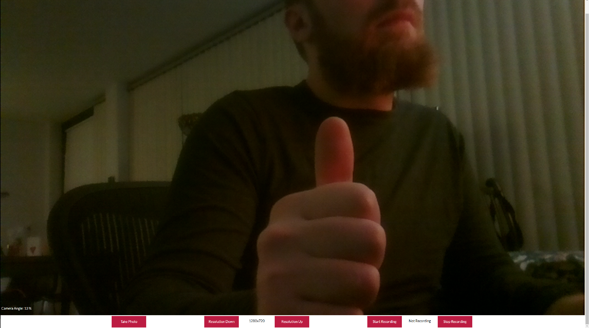

glamp
====

Yet Another Raspberry Pi camera webserver. This is mostly the original readme with some additions.



What it does
============

My fork of camp with a few QOL modifications. Hosts a website where you can view your webcam in real time.
Added buttons for basic photo taking and video recording as well as a resolution chooser in the web UI.
Has an example of controlling a servo with the camera mounted on it and displaying the tilt % from the pi in response.

Why I wrote it
==============

Camp is minimal and very useful and I wanted to extend it in a way that I could make more complex projects.
Simple options for low latency streaming that can control the pi and show sensor data on screen are pretty limited in my searching
so i extended camp to do just that. Glamp can be used to view webcams, control gpio devices, and display
their output all within a web browser and it includes an example of doing that with a servo connected as a tilt camera.

Installation
============

Camp uses [tornado](http://www.tornadoweb.org/en/stable/) to create a
web server. It can interact with the [Pi camera](http://www.adafruit.com/products/1367)
with the aptly named [picamera](http://picamera.readthedocs.org/en/release-1.7/)
module, or it can use USB webcams with [opencv](http://opencv.org/)
and [Pillow](http://pillow.readthedocs.org/en/latest/installation.html). The
command below installs both sets of dependencies.

```
sudo apt-get install python-dev python-pip python-opencv libjpeg-dev
sudo pip install tornado Pillow picamera
```

Once the dependencies are installed on your pi, you can clone this repository and
run the server.

```
git clone https://github.com/JoeK33/glamp.git
python glamp/server.py
```

Navigate to http://your.r.pi.ip:8000 and check out your webcam.

#### USB Camera

Not fully supported. Camp supports usb webcams but Glamp has only been extended for the picamera. I may update it to use
picamera2 once that has stabalized.

Use with `python server.py --use-usb`.

#### Password


With the `--require-login` flag, glamp will open a login page before allowing
webcam access.

The default password is "raspberry". In order to change it, run this in your
glamp directory:

```
python -c "import hashlib; import getpass; print(hashlib.sha512(getpass.getpass())).hexdigest()" > password.txt
```

This will prompt you for a password, encrypt it, and save the result in
`password.txt`.

Note that this level of password protection is basic - it's fine for keeping the
occasional stranger out, but won't stand up to targeted hacking.

#### Run on startup

It's nice to have your pi start glamp whenever it turns on. Let's make that
happen. Type `sudo nano /etc/rc.local` to open this file for editing, and add
the line `nohup python /home/pi/glamp/server.py &` before the last line. Note
that you may need to change the path (`/home/pi/glamp/server.py`) to point to
the right file.

#### Customization

The website consists of `index.html`, `login.html`, and `style.css`. These can be
edited to change the look of camp.

If you want to add in extra functionality, edit `client.js` and `server.py`.
The client should send a request to the server, which will then cause the
server to do something.

If you want to add in extra camera features, opencv comes with a lot of useful
computer vision algorithms. Check out its functionality before writing your
own.
